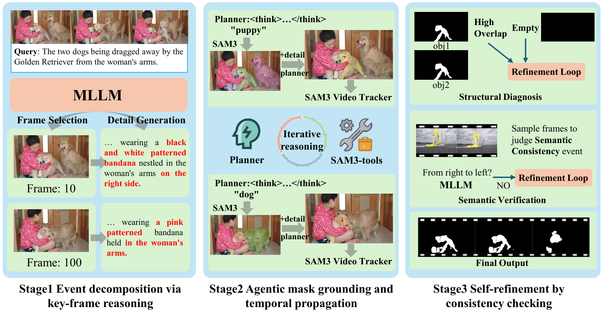

# The 1st Winner for 5th PVUW MeViS-Text Challenge: Strong MLLMs Meet SAM3 for Referring Video Object Segmentation

This repository is a code release of our solution to the 5th PVUW MeViSv2-Text challenge.

## Overview

The pipeline is organized into three stages:

1. **Stage 1: Event decomposition**  
   Use a multimodal large language model to decompose each target event into instance-level
   grounding targets, select the clearest frame for each target, and generate a discriminative
   description.
2. **Stage 2: Seed mask generation and propagation**  
   Use SAM3-agent to generate a seed mask on the selected frame, then propagate the mask through
   the video with the SAM3 tracker.
3. **Stage 3: Refinement and final export**  
   Inspect problematic predictions, regenerate descriptions when needed, verify behavior-level
   consistency, choose the best result, and build the final submission structure.

## Method Overview

Our method combines MLLM-based event decomposition, SAM3-agent seed-mask generation, SAM3 video
propagation, and a refinement stage for ambiguous or semantically inconsistent predictions.

## Dependencies

For environment setup and package installation, please refer to
`sam3_official/pyproject.toml` first. Our codebase is built around the official SAM3 code and
its dependency definitions.

## API Notes

- Qwen3.5-Plus is used through the official Alibaba Cloud Bailian service.
- Gemini-3.1-Pro is used through the third-party relay endpoint `api.vectorengine.ai`
  (in practice, we strongly suspect that this endpoint may mix different backends, but the final
  results are still satisfactory).

## Acknowledgement

We sincerely thank the authors of [SAM3](https://github.com/facebookresearch/sam3) for releasing
the official codebase, which provides the foundation for our Stage 2 grounding and propagation
pipeline.
We also thank the authors of [MeViS](https://github.com/henghuiding/MeViS) for their valuable
contribution to the referring video segmentation community and for making the related resources
publicly available.
